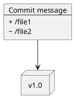

# Визуализатор графа зависимостей

## Описание
Этот инструмент представляет собой утилиту командной строки для визуализации графа зависимостей Git-репозитория. Он выводит граф зависимостей в формате PlantUML и, при наличии указанного исполняемого файла PlantUML, может преобразовать граф в изображение.

## Возможности
- Построение графа зависимостей коммитов для заданного тега.
- В узлах графа отображаются файлы и папки, относящиеся к каждому коммиту.
- Вывод графа в формате PlantUML.
- Возможность преобразования PlantUML-кода в изображение при наличии исполняемого файла PlantUML.

## Конфигурация
Для работы инструмент использует YAML-файл конфигурации (`config.yml`), в котором задаются параметры. Файл конфигурации включает следующие поля:

- **`token`** *(строка)*: Токен для аутентификации с сервером Git.
- **`repo`** *(строка)*: URL анализируемого Git-репозитория.
- **`tag`** *(строка)*: Имя анализируемого тега.
- **`depth`** *(целое число, опционально)*: Максимальное количество анализируемых коммитов (по умолчанию: `1000`).
- **`puml_executable`** *(строка, опционально)*: Путь к исполняемому файлу PlantUML для рендеринга графа.

## Вывод
Инструмент генерирует файл с расширением `.puml`, содержащий граф зависимостей, в папке `out/`. Если указан исполняемый файл PlantUML, также создается сгенерированное изображение.

## Установка
1. Склонируйте репозиторий на локальный компьютер.
2. Убедитесь, что установлен Python версии 3.12 или выше.
3. Установите необходимые пакеты Python:
   ```bash
   pip install requests pyyaml
   ```

## Использование
Создайте файл конфигурации (`config.yml`) в корневой директории проекта и заполните его необходимыми данными. Затем выполните скрипт:

```bash
python app.py
```

### Пример файла конфигурации
```yaml
repo: "https://github.com/user/repository"
tag: "v1.0"
token: "your_personal_access_token"
depth: 100
default: "1000"
puml_executable: "/path/to/plantuml.jar"
```

## Примеры
### Запуск инструмента
Базовый запуск:
```bash
python app.py
```

### Пример вывода
Сгенерированный файл `.puml` будет выглядеть следующим образом:


## Структура файлов
- **`app.py`**: Основной скрипт инструмента.
- **`config.yml`**: Файл конфигурации с параметрами репозитория, тега и других настроек.
- **`out/`**: Папка для выходных файлов.

## Тестирование
Все основные функции инструмента покрыты тестами. Для запуска тестов используйте:
```bash
pytest ./
```


## Зависимости
- Python 3.12+
- `requests`: Для выполнения API-запросов к серверу Git.
- `pyyaml`: Для обработки файла конфигурации.

## Ограничения
- Поддерживаются только публичные репозитории или приватные репозитории с доступом по токену.
- Для рендеринга изображения требуется PlantUML.
